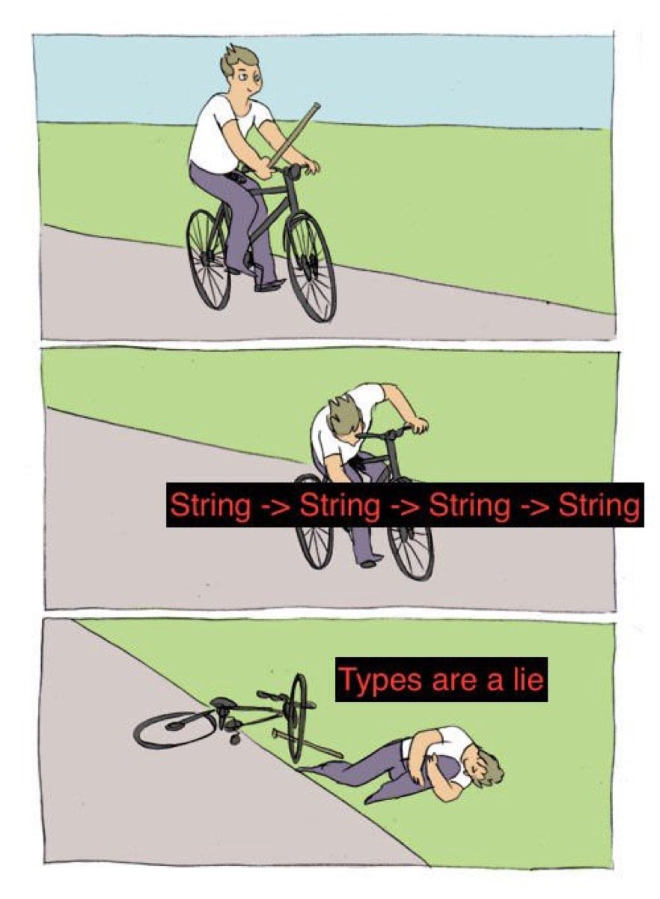

# identifiers

<p align="center"> String -> String -> String / Types are a lie" width="265" height="360"></p>

Typed identifier wrappers for Rust. Derive newtypes over `String`, `u64`,
`Uuid`, and URI that are mutually incompatible at the type level, eliminating
an entire class of argument-order bugs.

## The problem

APIs that take several IDs of the same underlying type are easy to misuse:

```rust
fn transfer_post(
    from_user: &str,
    to_user: &str,
    post_id: &str,
    org_id: &str,
) -> Result<(), Error> {
    // ...
}

// Compiles and runs. The bug ships.
transfer_post(&post_id, &org_id, &from_user, &to_user)?;
```

The compiler sees four `&str` parameters and happily accepts any permutation.
Tests may not catch it. The wrong record gets modified in production.

## The solution

Give each ID its own type. The compiler rejects wrong-order calls:

```rust
use identifiers::StringIdentifier;

#[derive(StringIdentifier)]
#[validate(non_empty)]
pub struct UserId(String);

#[derive(StringIdentifier)]
#[validate(non_empty)]
pub struct PostId(String);

#[derive(StringIdentifier)]
#[validate(non_empty)]
pub struct OrgId(String);

fn transfer_post(
    from_user: &UserId,
    to_user: &UserId,
    post_id: &PostId,
    org_id: &OrgId,
) -> Result<(), Error> {
    // ...
}

// error[E0308]: mismatched types — caught at compile time.
transfer_post(&post_id, &org_id, &from_user, &to_user)?;
```

## Installation

```toml
[dependencies]
identifiers = "0.1"

# Optional — only if you need UUID or URI identifiers:
identifiers-uuid = "0.1"
identifiers-uri  = "0.1"
```

## Defining identifier types

### String identifiers

```rust
use identifiers::StringIdentifier;

#[derive(StringIdentifier)]
#[validate(non_empty)]
pub struct UserId(String);
```

Construct via `TryFrom<String>`; validation runs at construction time:

```rust
let id = UserId::try_from("u_abc123".to_string())?;
assert_eq!(id.as_str(), "u_abc123");

// Debug output includes the type name:
// UserId("u_abc123")
```

The derive macro implements `Debug`, `Clone`, `PartialEq`, `Eq`, `Hash`,
`AsRef<str>`, `TryFrom<String>`, and `StringIdentifier`.

#### Validation options

| Attribute | Behaviour | Error type |
|-----------|-----------|------------|
| `#[validate(non_empty)]` | Rejects empty strings | `EmptyError` |
| `#[validate(non_blank)]` | Rejects empty and whitespace-only strings | `BlankError` |
| `#[validate(any)]` | Accepts all strings | `Infallible` |
| `#[validate(custom)]` or no attribute | User supplies `validate` | user-defined |

For custom validation, implement `StringIdentifier` manually; the derive still
generates all the boilerplate and `TryFrom<String>`:

```rust
use identifiers::StringIdentifier;

#[derive(StringIdentifier)]
#[validate(custom)]
pub struct Slug(String);

impl StringIdentifier for Slug {
    type Error = SlugError;

    fn validate(s: &str) -> Result<(), SlugError> {
        if s.chars().all(|c| c.is_ascii_alphanumeric() || c == '-') {
            Ok(())
        } else {
            Err(SlugError)
        }
    }
}
```

### Integer identifiers

```rust
use identifiers::IntegerIdentifier;

#[derive(IntegerIdentifier)]
pub struct InvoiceNumber(u64);
```

The derive macro implements `Debug`, `Clone`, `Copy`, `PartialEq`, `Eq`,
`Hash`, `PartialOrd`, `Ord`, `TryFrom<u64>`, and `IntegerIdentifier` with
infallible validation (accepts all `u64` values).

```rust
let n = InvoiceNumber::try_from(1042).unwrap();
assert_eq!(n.as_u64(), 1042);
assert!(InvoiceNumber::try_from(1).unwrap() < InvoiceNumber::try_from(2).unwrap());

// Zero value (useful as a sentinel or default floor):
let start = InvoiceNumber::zero();
```

Add `#[validate(custom)]` to supply your own `IntegerIdentifier` impl instead.
`#[validate(all)]` is an explicit alias for the default infallible behaviour.

### UUID identifiers

```toml
[dependencies]
identifiers-uuid = "0.1"
```

```rust
use identifiers_uuid::UuidIdentifier;

#[derive(UuidIdentifier)]
pub struct SessionId(Uuid);
```

The derive macro implements `Debug`, `Clone`, `Copy`, `PartialEq`, `Eq`,
`Hash`, `TryFrom<Uuid>`, and `UuidIdentifier` with infallible validation.
`SessionId::new()` generates a random v4 UUID.

```rust
let id = SessionId::new();
assert_ne!(id, SessionId::new()); // each call produces a unique value

let uuid = id.as_uuid();
let roundtripped = SessionId::try_from(uuid).unwrap();
assert_eq!(id, roundtripped);
```

Add `#[validate(custom)]` to supply your own `UuidIdentifier` impl instead.
`#[validate(all)]` is an explicit alias for the default infallible behaviour.

### URI identifiers

```toml
[dependencies]
identifiers-uri = "0.1"
```

```rust
use fluent_uri::Uri;
use identifiers_uri::UriIdentifier;

#[derive(UriIdentifier)]
pub struct ResourceUri(Uri<String>);
```

The derive macro implements `Debug`, `Clone`, `PartialEq`, `Eq`, `Hash`,
`TryFrom<Uri<String>>`, and `UriIdentifier` with infallible validation.

```rust
let uri = Uri::<String>::parse("https://example.com/resources/42".to_string()).unwrap();
let id = ResourceUri::try_from(uri).unwrap();
assert_eq!(id.as_uri().as_str(), "https://example.com/resources/42");
```

Add `#[validate(custom)]` to supply your own `UriIdentifier` impl instead.
`#[validate(all)]` is an explicit alias for the default infallible behaviour.

## Using identifiers as map keys

All identifier types implement `Hash` and `Eq`, so they work directly as
`HashMap` and `HashSet` keys.

```rust
use std::collections::HashMap;
use identifiers::StringIdentifier;

#[derive(StringIdentifier)]
#[validate(non_empty)]
pub struct UserId(String);

let mut scores: HashMap<UserId, u32> = HashMap::new();
scores.insert(UserId::try_from("u_1".to_string()).unwrap(), 100);
```

## Type constraints

Each derive macro only accepts a single-field tuple struct wrapping the
appropriate inner type. Annotating the wrong type or a non-newtype struct is a
compile error:

```rust
// error: expected a newtype struct with exactly one unnamed field
#[derive(StringIdentifier)]
#[validate(any)]
struct Bad { id: String }

// error[E0308]: mismatched types
#[derive(StringIdentifier)]
#[validate(any)]
struct AlsoBad(u64);
```

## License

MIT

---

Image via [@_anmonteiro](https://x.com/_anmonteiro/status/1652111152695087104).
